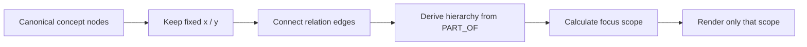
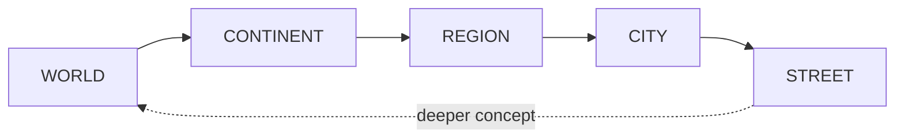
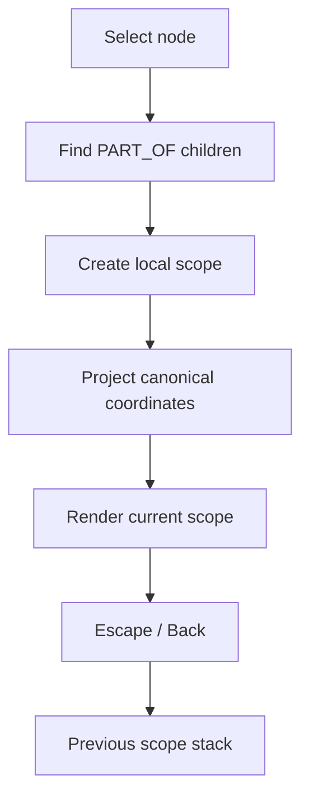
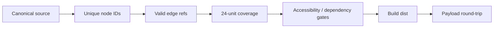

<div align="center">

# 🧠 SJHS Science Memory Palace

### Don't memorize a list. Navigate the map.

세종과학고 면담 준비를 위해 물리·화학·생명·지구과학을 **하나의 연결된 지식 공간**으로 만든 science knowledge graph입니다.

<p>
  
  
  
  
</p>

### [▶ Open the Memory Palace](https://rudwpahs.github.io/SJHS/)

[Graph](#the-graph) · [Semantic Zoom](#recursive-semantic-zoom) · [Validation](#graph-validation) · [Controls](#controls)

</div>

---

## At a glance

| Metric | Current |
|---|---:|
| Concepts | **198** |
| Relations | **291** |
| Middle-school science units | **24 / 24** |
| Orphan curriculum units | **0** |
| Dangling edges | **0** |

물리·화학·생명·지구과학을 따로 끊지 않고 **원초 원리 → 현상 → 교과 개념 → 실험 → 심화 내용**으로 이어지게 구성했습니다.

## The graph

Memory Palace에서 node의 위치는 단순한 UI 배치가 아니라 **기억 좌표**입니다. 따라서 zoom을 하더라도 canonical node의 `x`, `y`를 자동 재배치하지 않습니다.



> Zoom할 때 graph를 새로 만드는 것이 아니라 **같은 canonical graph에서 보여줄 범위만 바꿉니다.**

## Recursive semantic zoom



STREET에 도착해도 더 세부 구조가 있다면 그 node를 다시 하나의 local WORLD처럼 열 수 있습니다.



검색이나 교차 링크는 현재 scope 밖의 canonical 위치로도 바로 이동할 수 있습니다.

## Graph validation

빌드 전에 지식지도가 깨지지 않았는지 확인합니다.



## Source of truth

```text
src/SJHS_Memory_Palace_UIUX.html
```

루트의 과거 `index.html` / `sjhs-payload-*`는 legacy snapshot이며 Pages 배포 입력으로 사용하지 않습니다.

## Verify

```bash
npm test
npm run audit
npm run build
npm run verify
```

`npm run verify`는 테스트, graph 상태, 접근성 gate, build와 payload round-trip을 함께 확인합니다.

## Controls

| Action | Control |
|---|---|
| Select node | Click / keyboard focus |
| Enter concept | `이 개념 안으로` / `Shift+Enter` |
| Go back | `Escape` |
| Find concept | Search |

## UI principles

- keyboard focus를 항상 보이게 함
- interactive target 최소 44px
- map navigation의 keyboard 대안 제공
- light / dark semantic token 사용
- reduced-motion 지원
- 색 하나만으로 의미를 전달하지 않음

디자인 시스템은 `design-system/sjhs-memory-palace/MASTER.md`를 기준으로 합니다.

---

<div align="center">

**A science curriculum you can move through, not just scroll through.**

</div>
